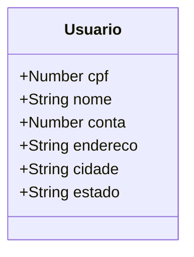

# RRG-SantanderSpringBoot
Este repositório ou projeto se presta a implementar a proposta de trabalho do professor Venilton Falvo Jr. Possuindo, entretanto, uma estrutura de dados muito mais simples

