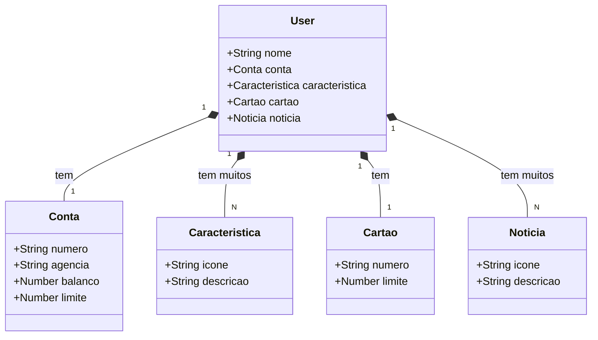

# RRG-SantanderSpringBoot
Este repositório ou projeto se presta a implementar a proposta de trabalho do professor Venilton Falvo Jr.

```mermaid
classDiagram
    class User {
        +String nome
        +Conta conta
        +Caracteristica caracteristica
        +Cartao cartao
        +Noticia noticia
    }

    class Conta {
        +String numero
        +String agencia
        +Number balanco
        +Number limite
    }

    class Caracteristica {
        +String icone
        +String descricao
    }

    class Cartao {
        +String numero
        +Number limite
    }

    class Noticia {
        +String icone
        +String descricao
    }

    User "1" *-- "1" Conta : tem
    User "1" *-- "N" Caracteristica : tem muitos
    User "1" *-- "1" Cartao : tem
    User "1" *-- "N" Noticia : tem muitos
```
